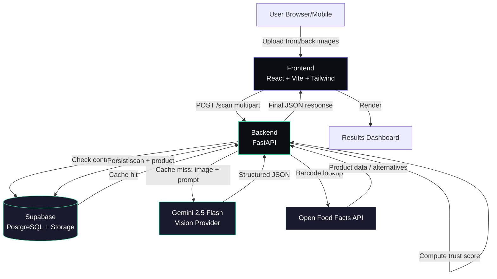

# AI Product Analyzer — System Architecture

**Status:** Hackathon MVP, designed with production discipline
**Audience:** Engineering team building this in a hackathon window

---

## Before the design: what I'd push back on

You asked me to challenge decisions before finalizing — here's what I'd change relative to a naive reading of the brief. Each is expanded in its relevant section below, this is just the summary.

1. **No login/auth system for MVP.** Full user accounts (signup, login, password reset, sessions) is 1-2 days of work that buys you nothing for a demo. Use an anonymous `device_id` (generated client-side, stored in `localStorage`, sent as a header) to group scan history per browser. Real auth is a Phase 2/Future item, not MVP.
2. **Ingredients stored as JSONB, not a normalized relational table.** A fully normalized `ingredients` + `scan_ingredients` join table is textbook correct at scale, but at hackathon scale it's pure overhead — extra migrations, extra joins, extra failure surface, zero user-visible benefit. Store ingredients as a JSONB array on `scan_results`. Postgres JSONB is fully queryable and indexable if you need it later.
3. **No Redis / external cache layer.** Cache scan results by image hash directly in Postgres (a `content_hash` column with a unique index). One less piece of infra to deploy, configure, and explain to judges.
4. **No microservices.** A single FastAPI monolith with clean internal layering (which you already asked for) gives you 100% of the architectural benefit judges care about (clean separation of concerns) with 0% of the deployment complexity. Microservices belong strictly in the "Future Architecture" section.
5. **Simple offset pagination for history, not cursor-based.** Cursor pagination is the "correct" answer at scale, but it's extra complexity for a feature (scan history) that in a demo will have single-digit rows. Offset pagination, revisit later.

Everything below assumes these five decisions. If you want auth or normalized ingredients back in scope, say so and I'll redesign those sections — but my recommendation is to keep the guardrails above for the hackathon build.

---

## 1. High-Level Architecture

```
User (browser/mobile)
    │
    ▼
Frontend — React + Vite (Vercel)
    │  - Image capture/upload UI
    │  - Client-side image compression before upload
    │  - Renders processing animation + results dashboard
    ▼
Backend — FastAPI (Render/Railway)
    │  - Validates uploads, orchestrates the pipeline
    │  - Owns all secrets (Gemini key, Supabase service key)
    │  - Never trusts the client for anything AI-derived
    ▼
AI Vision Layer — Gemini 2.5 Flash (provider-agnostic interface)
    │  - Single multimodal call: OCR + ingredient parsing + reasoning
    │  - Returns structured JSON, validated against a Pydantic schema
    ▼
External Enrichment — Open Food Facts API
    │  - If a barcode was extracted, look up real product data
    │  - Real data overrides AI-guessed data where available
    │  - Also source for data-backed "alternative product" suggestions
    ▼
Database — Supabase (PostgreSQL + Storage)
    │  - Persists scan results, product cache, images
    │  - Content-hash cache avoids re-calling Gemini for repeat images
    ▼
Response — merged, validated, scored JSON
    │
    ▼
Frontend renders the Results Dashboard
```

**Responsibility of each layer, stated precisely:**

| Layer | Owns | Does NOT own |
|---|---|---|
| Frontend | Presentation, client-side validation (file type/size), optimistic UI states | Business logic, scoring, AI calls, secrets |
| Backend | Orchestration, validation, scoring logic, secret management, persistence | Rendering, AI model internals |
| AI Vision Layer | Extraction + reasoning from images into structured data | Persistence, business rules like trust-score weighting |
| External Enrichment | Real-world product grounding | Health/risk judgments (that's the AI layer's job on ingredients) |
| Database | Durable state, caching, history | Any business logic (no stored procedures doing scoring) |

This is a **strict one-way data flow with no shortcuts** — the frontend never calls Gemini or Open Food Facts directly, even though both have public-reachable APIs. Every external call is proxied through the backend so API keys never touch the client and so every response passes through schema validation before it's trusted.

---

## 2. Frontend Architecture

```
frontend/
├── src/
│   ├── assets/                  # images, icons, fonts, brand assets
│   ├── components/
│   │   ├── ui/                  # Button, Card, Chip, Skeleton, Modal —
│   │   │                        #   pure, unopinionated primitives
│   │   ├── layout/               # Header, Footer, PageShell, GlassPanel
│   │   ├── landing/              # Hero, Features, HowItWorks, CTA
│   │   ├── scan/                 # UploadZone, ImagePreview, ScanTips
│   │   ├── processing/           # ScanLineAnimation, StepChecklist
│   │   └── results/
│   │       ├── HealthScoreRing.tsx
│   │       ├── TrustScoreCard.tsx
│   │       ├── IngredientCard.tsx        # Perplexity-style answer card
│   │       ├── IngredientList.tsx
│   │       ├── ProductInfoStrip.tsx
│   │       └── AlternativeSuggestion.tsx
│   ├── pages/                    # Home, Scan, Processing, Results, History, About
│   ├── layouts/                  # PublicLayout, DashboardLayout
│   ├── hooks/
│   │   ├── useScanUpload.ts       # upload + compression + submit
│   │   ├── useScanResult.ts       # fetch/poll scan result by id
│   │   ├── useDeviceId.ts         # anonymous device id (localStorage)
│   │   └── useCountUpAnimation.ts # shared score reveal animation
│   ├── services/
│   │   ├── api/
│   │   │   ├── client.ts          # fetch wrapper, base URL, headers
│   │   │   ├── scanService.ts     # POST /scan, GET /scans/:id
│   │   │   └── historyService.ts  # GET /scans
│   │   └── imageCompression.ts    # client-side resize before upload
│   ├── context/
│   │   └── ScanContext.tsx        # in-flight scan state across pages
│   ├── constants/
│   │   ├── routes.ts
│   │   └── uiCopy.ts              # centralized user-facing strings
│   ├── types/
│   │   └── scan.ts                # mirrors backend ScanResult schema
│   ├── utils/
│   │   ├── formatDate.ts
│   │   └── scoreColor.ts          # score → red/amber/green mapping
│   └── styles/
│       └── globals.css            # Tailwind base + design tokens
```

**Why each folder exists:**

- **`components/ui`** vs **`components/results`** — a hard split between *dumb, reusable primitives* and *feature-specific composition*. `ui/Card` knows nothing about health scores; `results/HealthScoreRing` composes `ui/Card` with domain logic. This is what keeps the codebase from calcifying into one-off components that can't be reused.
- **`hooks/`** — all stateful logic that isn't pure rendering lives here, so components stay close to pure functions of props. `useScanUpload` in particular owns the entire upload lifecycle (compress → submit → poll → error) so no page component has to know how that works.
- **`services/api/`** — the *only* place `fetch` is called. Pages and components never call `fetch` directly; they call a service function. This is what makes swapping REST for something else later a one-file change.
- **`context/ScanContext`** — deliberately minimal. Just enough shared state (current scan id, status) to let the Processing page and Results page stay in sync without prop-drilling through the router. Not a global state management library — not needed at this scope.
- **`constants/uiCopy.ts`** — every user-facing string in one place. Sounds like overkill for a hackathon, pays for itself the moment you're iterating on copy at 2am before a demo and don't want to hunt through 15 components.
- **`types/scan.ts`** — hand-mirrors the backend's Pydantic `ScanResult`. Not auto-generated for MVP (that's a nice-to-have, see Future Architecture) but kept in exact sync manually since the schema is small and stable.

---

## 3. Backend Architecture

```
backend/
├── app/
│   ├── main.py                    # FastAPI app instantiation, router mounting
│   ├── routes/                    # HTTP layer only — no business logic
│   │   ├── scan.py                # POST /scan, GET /scans/{id}
│   │   ├── history.py             # GET /scans
│   │   └── health.py              # GET /health (uptime check)
│   ├── controllers/                # thin orchestration between routes and services
│   │   └── scan_controller.py      # coordinates vision → enrichment → scoring → persist
│   ├── services/
│   │   ├── vision_extractor.py     # provider factory (already built)
│   │   ├── vision_providers/       # Gemini, OpenAI (already built)
│   │   ├── openfoodfacts_service.py    # barcode lookup + alternatives search
│   │   ├── trust_score_service.py      # packaging-signal → trust score math
│   │   └── cache_service.py            # content-hash lookup before calling AI
│   ├── prompts/
│   │   └── extraction_prompt.py    # already built, versioned prompt text
│   ├── schemas/                    # Pydantic request/response models
│   │   ├── scan_result.py          # already built
│   │   ├── scan_request.py
│   │   └── error.py
│   ├── models/                     # DB row models (Supabase table mirrors)
│   │   ├── scan.py
│   │   └── product.py
│   ├── db/
│   │   └── supabase_client.py      # single Supabase client instance
│   ├── middleware/
│   │   ├── cors.py
│   │   ├── rate_limit.py           # slowapi-based, per-IP
│   │   └── error_handler.py        # global exception → clean JSON error
│   ├── utils/
│   │   ├── image_validation.py     # mime/size/dimension checks
│   │   ├── hashing.py              # content hash for cache keys
│   │   └── logging.py
│   └── core/
│       └── config.py               # already built, env-based settings
├── tests/
├── .env.example
└── requirements.txt
```

**Module responsibilities, stated precisely:**

- **`routes/`** — HTTP concerns only: parse the request, call a controller, return the response. No `if`/`else` business logic belongs here. This is what makes routes trivially testable and keeps FastAPI's dependency injection clean.
- **`controllers/`** — the orchestration layer that routes delegate to. `scan_controller.run_scan()` is the one function that knows the *order* of operations (vision → enrichment → trust score → persist), but delegates every individual step to a service. This layer exists specifically so routes and services never talk to each other directly — controllers are the seam.
- **`services/`** — each service does exactly one thing and knows nothing about HTTP. `trust_score_service.py` takes a `PackagingSignals` object and returns a number; it has never heard of FastAPI. This is what lets you unit-test business logic without spinning up a server.
- **`schemas/` vs `models/`** — a deliberate split: `schemas` are API contracts (what goes over the wire), `models` are DB row shapes (what's persisted). They often look similar but conflating them is a classic mistake — the day you want to store a field you don't want to expose in the API (e.g. an internal confidence score), the split saves you.
- **`middleware/rate_limit.py`** — protects the Gemini API budget as much as it protects the server. A single malicious or buggy client hammering `/scan` can burn your entire hackathon API quota in minutes; this is not optional.
- **`utils/hashing.py`** + **`services/cache_service.py`** — together implement the "don't re-pay for a Gemini call on an image you've already scanned" optimization. Cheap to build, meaningfully protects your API budget during a demo where you might scan the same product twice.

---

## 4. API Design

### `POST /scan`
**Purpose:** Submit front + back product images for full analysis.

**Request:** `multipart/form-data`
```
front_image: file (jpeg/png/webp, max 8MB)
back_image:  file (jpeg/png/webp, max 8MB)
```
Headers: `X-Device-Id: <client-generated uuid>` (optional; anonymous history grouping)

**Validation:**
- Both files required, must be valid image mime types
- Max 8MB per file (reject before ever calling Gemini)
- Minimum dimension check (e.g. 200x200) to reject accidental non-label uploads early

**Response — 200 OK**
```json
{
  "scan_id": "b7e2f8a0-...",
  "product_name": "Choco Crunch Bar",
  "brand": "Sample Brand",
  "category": "Confectionery",
  "barcode": "8901234567890",
  "expiry_status": "valid",
  "health_score": 4.5,
  "health_score_reasoning": "High in added sugar and saturated fat, moderate ingredient risk overall.",
  "ingredients": [
    {
      "name": "Palm Oil",
      "risk_level": "moderate",
      "explanation": "High in saturated fat; frequent consumption may affect heart health.",
      "flags": ["saturated_fat"]
    }
  ],
  "packaging_signals": {
    "text_clarity": "clear",
    "barcode_present": true,
    "barcode_format_valid": true,
    "notable_inconsistencies": []
  },
  "trust_score": 82,
  "warnings": ["high_sugar", "contains_palm_oil"],
  "alternatives": [
    {
      "source": "openfoodfacts",
      "product_name": "Oat Bar Original",
      "reason": "Lower sugar, no palm oil"
    }
  ],
  "source": "openfoodfacts_merged"
}
```

**Error Responses:**
| Status | Case | Body |
|---|---|---|
| 400 | Missing/invalid file | `{"detail": "front_image and back_image are required image files."}` |
| 413 | File too large | `{"detail": "Image exceeds 8MB limit."}` |
| 422 | Validation failure (Pydantic) | FastAPI's standard validation error body |
| 429 | Rate limit exceeded | `{"detail": "Too many scans. Please wait a moment and try again."}` |
| 502 | AI provider failure | `{"detail": "We couldn't analyze this product image. Please try a clearer photo."}` |
| 504 | AI provider timeout | `{"detail": "Analysis is taking longer than expected. Please try again."}` |

---

### `GET /scans/{scan_id}`
**Purpose:** Retrieve a previously completed scan (used if you poll rather than block on `/scan`).

**Request:** path param `scan_id: uuid`

**Response — 200 OK:** same shape as `POST /scan` response.

**Errors:** `404` if not found — `{"detail": "Scan not found."}`

---

### `GET /scans`
**Purpose:** Anonymous history, scoped to the requesting device.

**Request:** Header `X-Device-Id` (required), query params `limit` (default 20, max 50), `offset` (default 0)

**Response — 200 OK**
```json
{
  "results": [
    { "scan_id": "...", "product_name": "...", "health_score": 4.5, "created_at": "2026-07-18T10:22:00Z" }
  ],
  "total": 7,
  "limit": 20,
  "offset": 0
}
```

**Errors:** `400` if `X-Device-Id` missing — `{"detail": "X-Device-Id header is required."}`

---

### `GET /health`
**Purpose:** Uptime/monitoring check, also useful to prove the deployment is alive to judges live.

**Response — 200 OK:** `{"status": "ok", "version": "1.0.0"}`

---

## 5. Database Design (Supabase / PostgreSQL)

Per the earlier guardrail: **no `users` table for MVP**, ingredients stored as JSONB, no separate `history` table (history is just a query over `scans`).

```sql
-- Products: deduplicated cache of anything we've ever resolved,
-- keyed by barcode when available.
CREATE TABLE products (
    id              UUID PRIMARY KEY DEFAULT gen_random_uuid(),
    barcode         TEXT UNIQUE,
    product_name    TEXT,
    brand           TEXT,
    category        TEXT,
    off_data        JSONB,              -- raw OpenFoodFacts payload, cached
    created_at      TIMESTAMPTZ DEFAULT now(),
    updated_at      TIMESTAMPTZ DEFAULT now()
);

-- Scans: one row per user-submitted scan.
CREATE TABLE scans (
    id                  UUID PRIMARY KEY DEFAULT gen_random_uuid(),
    device_id           TEXT,                     -- anonymous grouping key
    product_id          UUID REFERENCES products(id),
    content_hash        TEXT UNIQUE,               -- for cache lookups
    front_image_url     TEXT,
    back_image_url      TEXT,
    health_score         NUMERIC(3,1),
    health_score_reason  TEXT,
    trust_score          NUMERIC(5,2),
    expiry_status        TEXT CHECK (expiry_status IN ('valid','expired','unclear')),
    packaging_signals    JSONB,
    ingredients           JSONB,           -- array of {name, risk_level, explanation, flags}
    warnings               TEXT[],
    alternatives            JSONB,
    ai_provider              TEXT,          -- e.g. 'gemini-2.5-flash', for later comparison
    prompt_version           TEXT,
    source                    TEXT CHECK (source IN ('ai_extracted','openfoodfacts_merged')),
    created_at                TIMESTAMPTZ DEFAULT now()
);

CREATE INDEX idx_scans_device_id ON scans (device_id, created_at DESC);
CREATE INDEX idx_scans_content_hash ON scans (content_hash);
CREATE INDEX idx_products_barcode ON products (barcode);
```

**ER Diagram (text form):**
```
products (1) ────────< (many) scans
  id  PK                 id  PK
  barcode UNIQUE          product_id  FK → products.id
  product_name             device_id      (no FK — anonymous)
  brand                    content_hash UNIQUE
  category                 ingredients JSONB
  off_data JSONB            health_score
                             trust_score
                             warnings TEXT[]
                             alternatives JSONB
```

**Relationships:**
- `scans.product_id → products.id` — optional (null when no barcode was ever resolved)
- No FK from `scans` to a users table — `device_id` is a free-text anonymous key, not a foreign key, by design

**Indexes and why:**
- `idx_scans_device_id` — every history query filters + sorts by this; without it, history becomes a full table scan as soon as you have real demo traffic
- `idx_scans_content_hash` — the cache-lookup path (`WHERE content_hash = ?`) needs to be O(1), this is the entire point of the cache
- `idx_products_barcode` — OFF enrichment path looks up by barcode before hitting the external API

**Future scalability notes (not built now, but the schema doesn't block them):**
- Adding a real `users` table later is a non-breaking migration: add `user_id UUID REFERENCES users(id)`, backfill nothing, keep `device_id` for anonymous sessions that never sign up
- If ingredient-level querying/analytics becomes a real need (e.g. "show me all scans containing Red 40 across all users"), the JSONB column can be migrated to a normalized table without touching any other part of the schema — Postgres JSONB → relational migrations are a well-trodden path

---

## 6. AI Architecture

```
1. Image Upload
   → Frontend compresses images client-side (max ~1600px longest edge)
     before upload, to keep payloads small and Gemini calls fast.

2. Image Validation (backend)
   → mime type, size, dimension checks. Reject obviously-invalid input
     before spending an AI call on it.

3. Cache Check
   → Compute content hash of (front_image + back_image). If a scan with
     this hash exists, return it immediately — no AI call at all.

4. Gemini Vision Call
   → Single multimodal request: both images + the extraction prompt.
   → Low temperature (0.2) for consistency over creativity.
   → JSON-mode response requested directly from the API.

5. Schema Validation
   → Raw JSON parsed and validated against the ScanResult Pydantic
     schema. Malformed output fails loudly here — never reaches the
     frontend as a broken partial object.

6. OpenFoodFacts Enrichment (conditional)
   → If a barcode was extracted and passes format validation, look it
     up. On a match, real product_name/brand/ingredients override the
     AI-guessed equivalents — real data always wins over inferred data.

7. Trust Score Computation
   → Deterministic function (not an AI call) over packaging_signals:
     barcode validity, text clarity, presence of noted inconsistencies.
     Documented, explainable math — you can show a judge the formula.

8. Alternative Suggestions
   → If OFF match with category data: query OFF for better-scoring
     products in the same category (real, named products).
   → Else: AI provides category-level guidance only, no named brands.

9. Persist
   → Write the full result to `scans`, upsert `products` if a barcode
     was resolved.

10. Final Response
    → Merged, validated, scored JSON returned to the frontend.
```

**Why the cache check happens before the AI call, not after:** it's the only ordering that actually saves the API cost and the latency — checking after the call defeats the entire point.

**Why trust score is deterministic and not another AI call:** two reasons. First, cost — no need to spend a second model call computing something you can compute with arithmetic. Second, and more important for a demo: when a judge asks "how is this score calculated," you want to point at a formula, not shrug and say "the model decided."

---

## 7. Prompt Engineering Strategy

**System prompt vs. developer prompt split:**
- **System prompt** (identity + hard constraints): defines the model's role ("You are a food/product label analysis engine"), and the constraints that must never be violated regardless of what's in the images — no fabrication, no counterfeit verdicts, JSON-only output.
- **Developer/task prompt** (the schema + task instructions): the exact JSON shape required and the per-field rules (risk_level criteria, explanation tone). This is the part most likely to be iterated on as you tune quality, so keeping it separate from the identity/constraints block means you can revise task instructions without accidentally weakening a safety constraint.

In the current single-string implementation these are concatenated, but logically separated within the file (see `prompts/extraction_prompt.py` — constraints are grouped under "Rules" at the end specifically so they read as non-negotiable regardless of what comes before).

**Output JSON format:** locked to the `ScanResult` Pydantic schema — the prompt's described shape and the schema are required to match field-for-field, checked by validation on every response, not just spot-checked during development.

**Fallback handling:**
- If Gemini returns non-JSON or fails schema validation once, retry the call once with a slightly stricter instruction appended ("Your previous response was not valid JSON. Return ONLY the JSON object.").
- If retry also fails, return a clean 502 to the client rather than a partial/guessed object — a clear error beats a silently wrong report.

**Error handling:** every provider failure mode (network error, empty response, malformed JSON, schema mismatch) is normalized into a single `VisionProviderError` at the provider boundary, so the route layer has exactly one failure case to handle regardless of which underlying model is running.

**Hallucination prevention, concretely:**
- Explicit `null`-over-fabrication instruction for any field not visibly extractable
- `risk_level: "high"` restricted to ingredients with real evidence of harm — the prompt names the category of evidence expected, discouraging the model from inventing danger to seem thorough
- Packaging signals limited to *observations*, explicitly forbidden from concluding authenticity — this is a hallucination-prevention rule as much as a legal-safety one
- Low temperature (0.2) — reduces creative drift on a task that should be extractive, not generative
- Real data (Open Food Facts) always overrides AI-guessed data when both exist, so hallucination risk on product identity specifically is structurally reduced, not just prompted away

---

## 8. Security

| Concern | Approach |
|---|---|
| Image uploads | Server-side mime/size/dimension validation before any processing; images stored in Supabase Storage with unguessable UUID paths, not user-controlled filenames |
| API Keys | Gemini + Supabase service keys live only in backend environment variables, never shipped to the client, never logged |
| Backend | All business logic server-side; client is never trusted for scores, risk levels, or trust signals — those are always recomputed/validated server-side even if a request tried to pass them |
| Supabase | Row Level Security enabled; since there's no auth, RLS policies scope by `device_id` match for reads, and all writes go through the backend's service key (never a client-side anon key with write access) |
| Rate limiting | Per-IP limit on `/scan` (e.g. 10/hour) via `slowapi` — protects both your Gemini budget and Supabase from abuse |
| Input validation | Every request body validated through Pydantic before touching business logic; file uploads validated for real content type (not trusting the extension) |
| CORS | Locked to the deployed frontend origin only, not `*` — even for a hackathon, an open CORS policy on an endpoint that calls a paid AI API is a real cost risk |
| Secrets | `.env` files gitignored; `.env.example` committed with placeholder values only; production secrets set directly in the hosting platform's dashboard, never committed |
| Environment Variables | Separate `.env` per environment (local/staging/prod) if time allows; at minimum, local vs. deployed are never the same file |

---

## 9. Performance

- **Caching:** content-hash based, in Postgres (see Database Design) — repeat scans of the same images return instantly with zero AI cost.
- **Compression:** images resized client-side to a max dimension before upload; Gemini doesn't need a 12MP photo to read a label, and smaller payloads mean faster uploads on demo wifi.
- **Image optimization:** convert to JPEG at a reasonable quality client-side if the source is a much larger format (e.g. HEIC from iPhone) before upload.
- **Loading states:** the Processing screen's step checklist should reflect *real* backend progress (via short polling or a lightweight SSE stream) rather than a fixed fake timer — fake delays are noticeable and read as dishonest in a live demo.
- **Lazy loading:** route-level code splitting (`React.lazy`) for the Results dashboard and History page, so the initial landing page bundle stays small.
- **Parallel API calls:** the OFF lookup depends on the barcode extracted by Gemini, so it's inherently sequential — do not try to parallelize this, it isn't possible. What *can* run in parallel: writing the scan to Supabase and returning the response to the client (persist asynchronously, don't make the user wait on the DB write).
- **Retry strategies:** one automatic retry on Gemini call failure (network-level) with exponential backoff (e.g. 500ms then 1.5s); do not retry more than once automatically — a hung request should fail fast enough that the user isn't staring at a spinner for 30 seconds.
- **Timeout handling:** hard timeout on the Gemini call (e.g. 20s) — if it hasn't returned by then, fail with a clear "try again" message rather than leaving the request hanging indefinitely.

---

## 10. Deployment Architecture

| Component | Recommendation | Why |
|---|---|---|
| Frontend | Vercel | Zero-config Vite deploys, instant preview URLs per branch/PR — useful for iterating fast before the demo |
| Backend | Render or Railway | Both support FastAPI out of the box with minimal config, free/cheap tiers sufficient for hackathon load |
| Database | Supabase (managed Postgres) | Already the chosen DB; managed means no ops burden during the hackathon |
| Storage | Supabase Storage | Same project as the DB, one less service to configure/auth against |
| Environment Variables | Set directly in Vercel/Render dashboards | Never committed; `.env.example` in repo for onboarding only |
| Domain | A free subdomain from the hosting platform is fine for a hackathon; a custom domain is a nice-to-have, not worth the DNS propagation risk right before a demo |
| CDN | Vercel's edge network handles the frontend automatically; no separate CDN needed at this scale |
| CI/CD | GitHub Actions: lint + type-check on PR, auto-deploy `main` to Vercel/Render on merge |

---

## 11. Development Roadmap

**Phase 1 — Project Setup:** repo scaffolding (frontend + backend), env config, Supabase project creation, base deployment pipeline working end-to-end with a placeholder "hello world" on both ends.

**Phase 2 — Backend Core:** `/scan` route, `ScanResult` schema, Gemini provider integration, prompt tuned against 5-6 real product photos until extraction is reliable.

**Phase 3 — Enrichment & Scoring:** OpenFoodFacts integration, trust score service, alternatives logic, caching layer.

**Phase 4 — Persistence:** Supabase schema migration, scan persistence, history endpoint.

**Phase 5 — Frontend Shell:** landing page, upload flow, processing screen wired to real backend state.

**Phase 6 — Results Dashboard:** health score ring, ingredient cards, trust score card, alternatives — the highest-polish phase, budget the most time here.

**Phase 7 — Integration & Hardening:** full end-to-end testing against real products, error states, rate limiting, timeout handling, retry logic.

**Phase 8 — Demo Prep:** pick 3 real products, pre-test until bulletproof, record a backup demo video, deploy final build, smoke-test the deployed URL (not just localhost) the night before.

---

## 12. Folder Structure (complete monorepo)

```
ai-product-analyzer/
├── frontend/                  # React + Vite app (see Section 2)
├── backend/                   # FastAPI app (see Section 3)
├── docs/
│   ├── ARCHITECTURE.md        # this document
│   ├── PROJECT_CONTEXT.md
│   └── API.md                 # generated/maintained OpenAPI reference
├── prompts/
│   └── extraction_prompt_v1.md   # human-readable copy of the live prompt,
│                                  #   for review outside the codebase
├── assets/
│   └── brand/                 # logo, favicon, social preview image
├── .github/
│   └── workflows/
│       └── ci.yml
├── .gitignore
└── README.md
```

---

## 13. Architecture Diagram (Mermaid)



---

## 14. Sequence Diagram (Mermaid)

```mermaid
sequenceDiagram
    actor User
    participant FE as Frontend
    participant BE as Backend (FastAPI)
    participant Cache as Supabase (cache check)
    participant AI as Gemini Vision
    participant OFF as Open Food Facts
    participant DB as Supabase (persist)

    User->>FE: Upload front + back images
    FE->>FE: Compress images client-side
    FE->>BE: POST /scan (multipart)
    BE->>BE: Validate mime/size/dimensions
    BE->>Cache: Lookup by content_hash
    alt Cache hit
        Cache-->>BE: Existing ScanResult
    else Cache miss
        BE->>AI: images + extraction prompt
        AI-->>BE: Structured JSON
        BE->>BE: Validate against ScanResult schema
        alt barcode present
            BE->>OFF: Lookup by barcode
            OFF-->>BE: Product data (or no match)
            BE->>BE: Merge real data over AI-guessed data
            BE->>OFF: Query category for alternatives
            OFF-->>BE: Alternative products
        end
        BE->>BE: Compute trust_score (deterministic)
        BE->>DB: Persist scan + upsert product
    end
    BE-->>FE: Final ScanResult JSON
    FE->>FE: Render Health Score ring (count-up)
    FE->>FE: Render Ingredient Intelligence cards
    FE-->>User: Full Results Dashboard
```

---

## 15. Future Architecture (post-hackathon scale-up)

| Capability | How it layers onto this MVP |
|---|---|
| **Authentication** | Add a `users` table + Supabase Auth; `device_id` becomes a migration path — anonymous scans can be claimed by a user on signup rather than lost |
| **Admin Dashboard** | New frontend app (or route group) reading the same Supabase tables read-only; no backend changes needed beyond admin-scoped RLS policies |
| **Analytics** | Event tracking (PostHog/Amplitude) added at the frontend + key backend events (scan completed, error rate); doesn't touch the core pipeline |
| **Multiple AI Providers** | Already designed in — `OpenAIProvider` stub exists, just needs implementation; could add per-request provider selection or A/B comparison logging |
| **Microservices** | Split `vision_extractor`, `openfoodfacts_service`, and persistence into independently deployable services once traffic or team size justifies the operational overhead — not before |
| **Notification System** | Recall alerts, expiry reminders — requires a background job runner (e.g. Supabase Edge Functions or a proper task queue), doesn't exist in MVP |
| **Recommendation Engine** | The current OFF-based alternatives logic is the seed; a real engine would need a proper product embedding/similarity index, which is a genuine ML project of its own |
| **Product Database** | The `products` table already exists and is the foundation — future work is deduplication quality and manufacturer-submitted data ingestion |
| **Manufacturer Dashboard** | A new auth-gated frontend surface for manufacturers to claim/verify their products in the `products` table |
| **Community Reports** | New table (`reports`) linked to `products`, with moderation workflow — deliberately out of MVP scope given moderation is a real operational burden |
| **Offline Support** | Service worker + local queue for scans taken with no connectivity, synced when back online — meaningful mobile-web feature, not MVP |
| **Mobile App** | The backend API is already platform-agnostic (REST + JSON); a React Native or native app is a new frontend consuming the same `/scan` contract, no backend changes required |

---

**Bottom line:** this architecture is intentionally sized to be buildable in a hackathon window while every cut corner (auth, normalization, microservices, caching infra) is a *documented, deliberate* deferral with a clear path forward — not an accident you'll discover under pressure later.
